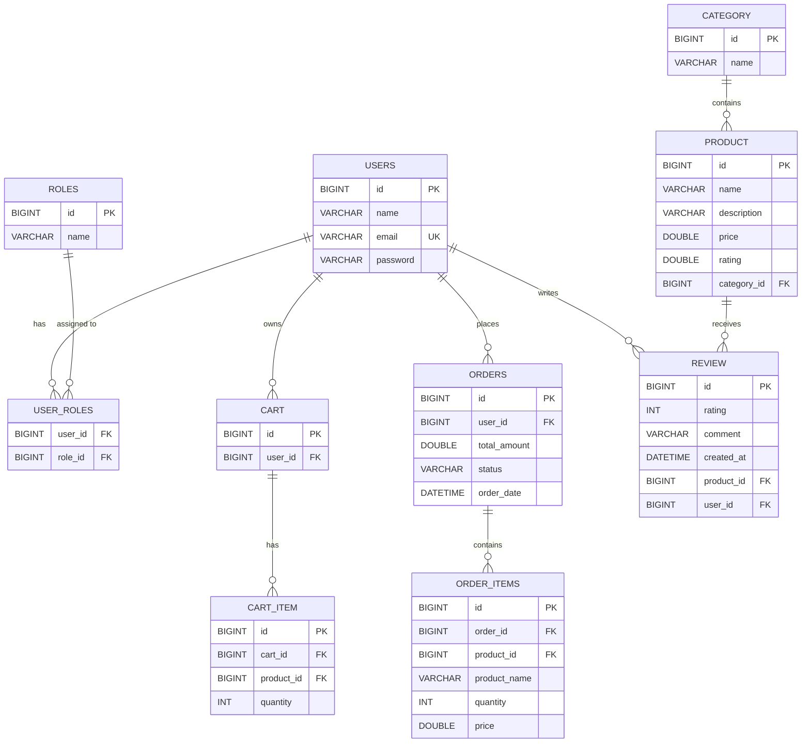

# ER Diagram – AI E-Commerce Platform

## Entity-Relationship Diagram

---

## Table Descriptions

| Table         | Description                                    |
|---------------|------------------------------------------------|
| `users`       | Stores user accounts (name, email, password)   |
| `roles`       | Defines roles (ADMIN, USER)                    |
| `user_roles`  | Many-to-many join table for users and roles    |
| `category`    | Product categories                             |
| `product`     | Products with name, description, price, rating |
| `cart`        | One cart per user                               |
| `cart_item`   | Items in a cart with quantity                   |
| `orders`      | Customer orders with total and status           |
| `order_items` | Individual items within an order                |
| `review`      | Product reviews with rating and comment         |

---

## Key Relationships

- **User ↔ Role**: Many-to-Many (via `user_roles`)
- **User → Cart**: One-to-One (each user has one cart)
- **User → Order**: One-to-Many (user places multiple orders)
- **User → Review**: One-to-Many (user writes multiple reviews)
- **Category → Product**: One-to-Many (category contains products)
- **Product → Review**: One-to-Many (product receives reviews)
- **Cart → CartItem**: One-to-Many (cart has items)
- **Order → OrderItem**: One-to-Many (order contains items)
