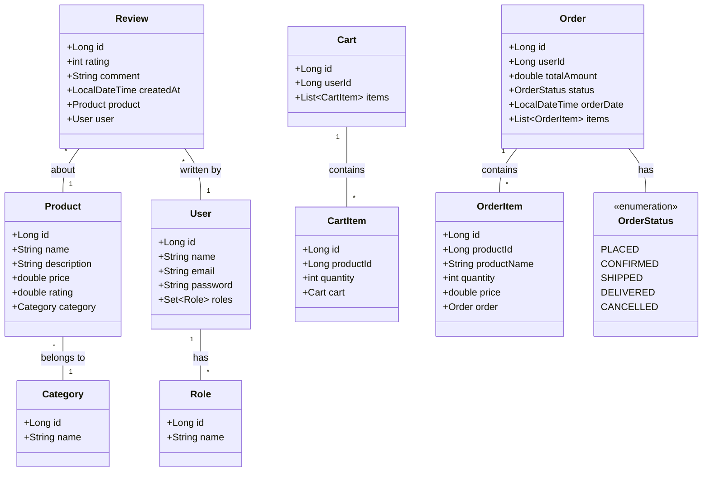
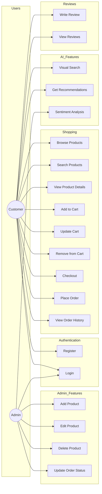
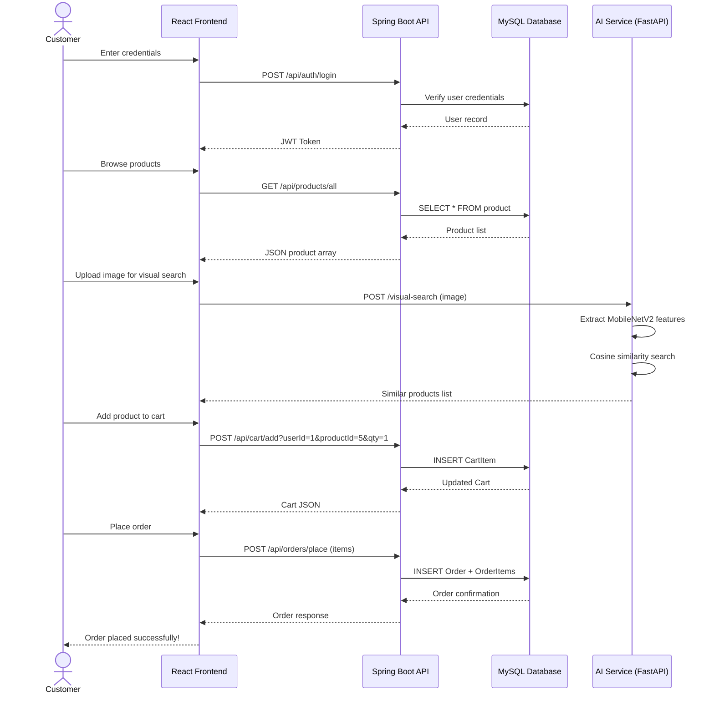
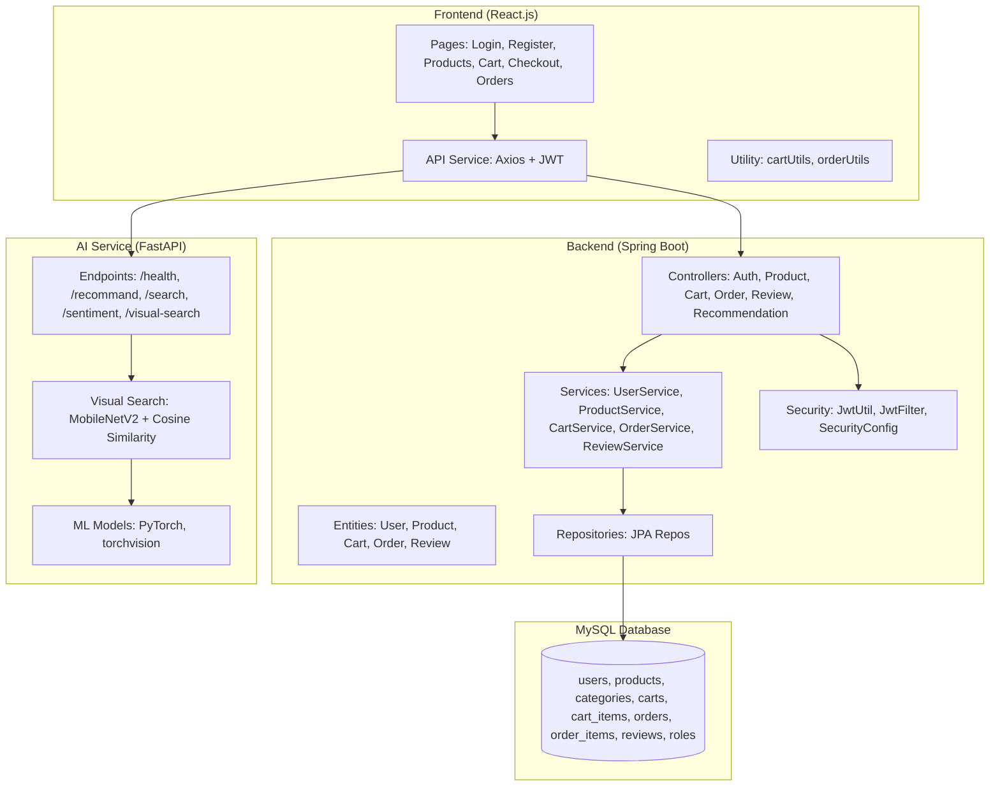

# UML Diagrams – AI E-Commerce Platform

---

## 1. Class Diagram

```mermaid
classDiagram
    class User {
        +Long id
        +String name
        +String email
        +String password
        +Set~Role~ roles
    }

    class Role {
        +Long id
        +String name
    }

    class Product {
        +Long id
        +String name
        +String description
        +double price
        +double rating
        +Category category
    }

    class Category {
        +Long id
        +String name
    }

    class Cart {
        +Long id
        +Long userId
        +List~CartItem~ items
    }

    class CartItem {
        +Long id
        +Long productId
        +int quantity
        +Cart cart
    }

    class Order {
        +Long id
        +Long userId
        +double totalAmount
        +OrderStatus status
        +LocalDateTime orderDate
        +List~OrderItem~ items
    }

    class OrderItem {
        +Long id
        +Long productId
        +String productName
        +int quantity
        +double price
        +Order order
    }

    class OrderStatus {
        <<enumeration>>
        PLACED
        CONFIRMED
        SHIPPED
        DELIVERED
        CANCELLED
    }

    class Review {
        +Long id
        +int rating
        +String comment
        +LocalDateTime createdAt
        +Product product
        +User user
    }

    User "1" -- "*" Role : has
    Product "*" -- "1" Category : belongs to
    Cart "1" -- "*" CartItem : contains
    Order "1" -- "*" OrderItem : contains
    Order -- OrderStatus : has
    Review "*" -- "1" Product : about
    Review "*" -- "1" User : written by
```

---

## 2. Use Case Diagram

```mermaid
graph LR
    subgraph Users
        Customer((Customer))
        Admin((Admin))
    end

    subgraph Authentication
        Register[Register]
        Login[Login]
    end

    subgraph Shopping
        Browse[Browse Products]
        Search[Search Products]
        ViewProduct[View Product Details]
        AddCart[Add to Cart]
        UpdateCart[Update Cart]
        RemoveCart[Remove from Cart]
        Checkout[Checkout]
        PlaceOrder[Place Order]
        ViewOrders[View Order History]
    end

    subgraph AI_Features
        VisualSearch[Visual Search]
        Recommend[Get Recommendations]
        Sentiment[Sentiment Analysis]
    end

    subgraph Admin_Features
        AddProduct[Add Product]
        EditProduct[Edit Product]
        DeleteProduct[Delete Product]
        UpdateOrderStatus[Update Order Status]
    end

    subgraph Reviews
        WriteReview[Write Review]
        ViewReviews[View Reviews]
    end

    Customer --> Register
    Customer --> Login
    Customer --> Browse
    Customer --> Search
    Customer --> ViewProduct
    Customer --> AddCart
    Customer --> UpdateCart
    Customer --> RemoveCart
    Customer --> Checkout
    Customer --> PlaceOrder
    Customer --> ViewOrders
    Customer --> VisualSearch
    Customer --> Recommend
    Customer --> WriteReview
    Customer --> ViewReviews

    Admin --> Login
    Admin --> AddProduct
    Admin --> EditProduct
    Admin --> DeleteProduct
    Admin --> UpdateOrderStatus
    Admin --> Sentiment
```

---

## 3. Sequence Diagram — User Login & Product Purchase Flow

```mermaid
sequenceDiagram
    actor Customer
    participant Frontend as React Frontend
    participant Backend as Spring Boot API
    participant DB as MySQL Database
    participant AI as AI Service (FastAPI)

    Customer->>Frontend: Enter credentials
    Frontend->>Backend: POST /api/auth/login
    Backend->>DB: Verify user credentials
    DB-->>Backend: User record
    Backend-->>Frontend: JWT Token

    Customer->>Frontend: Browse products
    Frontend->>Backend: GET /api/products/all
    Backend->>DB: SELECT * FROM product
    DB-->>Backend: Product list
    Backend-->>Frontend: JSON product array

    Customer->>Frontend: Upload image for visual search
    Frontend->>AI: POST /visual-search (image)
    AI->>AI: Extract MobileNetV2 features
    AI->>AI: Cosine similarity search
    AI-->>Frontend: Similar products list

    Customer->>Frontend: Add product to cart
    Frontend->>Backend: POST /api/cart/add?userId=1&productId=5&qty=1
    Backend->>DB: INSERT CartItem
    DB-->>Backend: Updated Cart
    Backend-->>Frontend: Cart JSON

    Customer->>Frontend: Place order
    Frontend->>Backend: POST /api/orders/place (items)
    Backend->>DB: INSERT Order + OrderItems
    DB-->>Backend: Order confirmation
    Backend-->>Frontend: Order response
    Frontend-->>Customer: Order placed successfully!
```

---

## 4. Component Diagram

```mermaid
graph TB
    subgraph Frontend ["Frontend (React.js)"]
        Pages[Pages: Login, Register, Products, Cart, Checkout, Orders]
        Services[API Service: Axios + JWT]
        Utils[Utility: cartUtils, orderUtils]
    end

    subgraph Backend ["Backend (Spring Boot)"]
        Controllers[Controllers: Auth, Product, Cart, Order, Review, Recommendation]
        ServiceLayer[Services: UserService, ProductService, CartService, OrderService, ReviewService]
        Security[Security: JwtUtil, JwtFilter, SecurityConfig]
        Entities[Entities: User, Product, Cart, Order, Review]
        Repos[Repositories: JPA Repos]
    end

    subgraph AIService ["AI Service (FastAPI)"]
        Endpoints[Endpoints: /health, /recommand, /search, /sentiment, /visual-search]
        VisualSearch[Visual Search: MobileNetV2 + Cosine Similarity]
        Models[ML Models: PyTorch, torchvision]
    end

    subgraph Database ["MySQL Database"]
        Tables[(users, products, categories, carts, cart_items, orders, order_items, reviews, roles)]
    end

    Pages --> Services
    Services --> Controllers
    Controllers --> ServiceLayer
    ServiceLayer --> Repos
    Repos --> Tables
    Controllers --> Security
    Services --> Endpoints
    Endpoints --> VisualSearch
    VisualSearch --> Models
```
